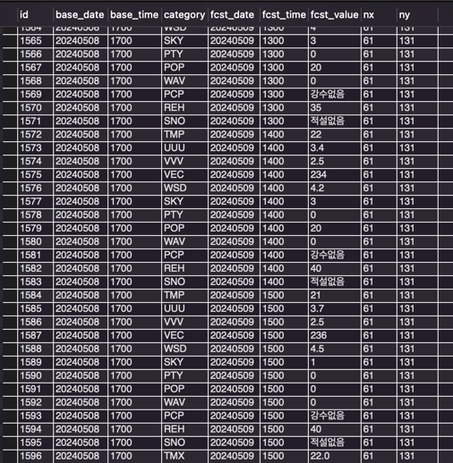
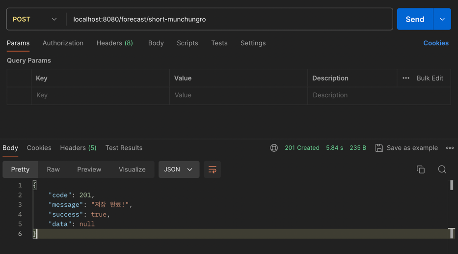
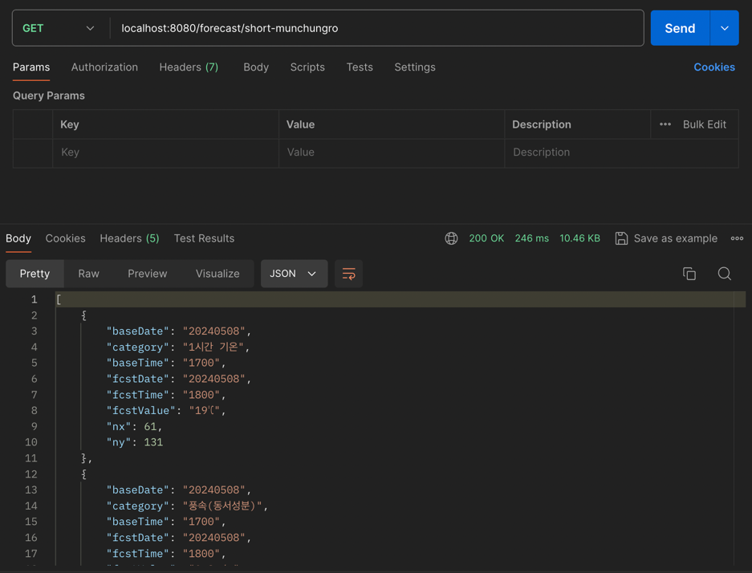
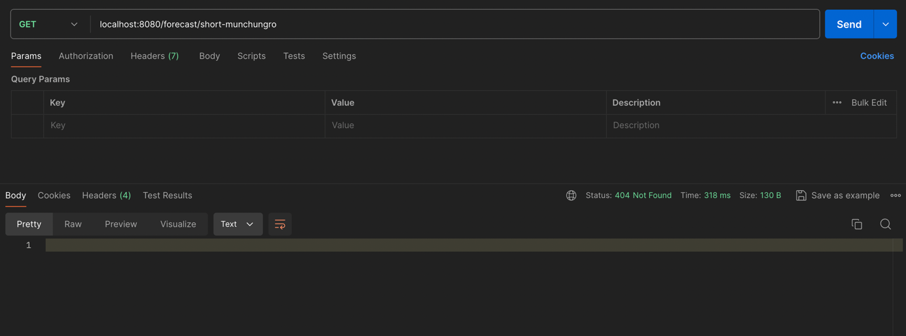
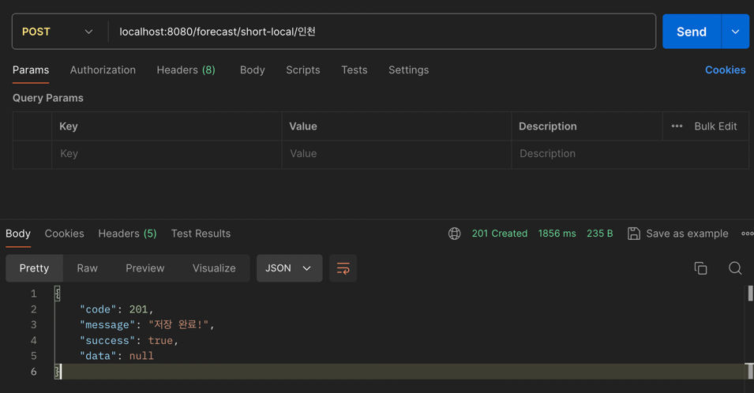
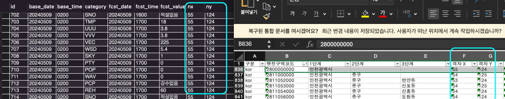
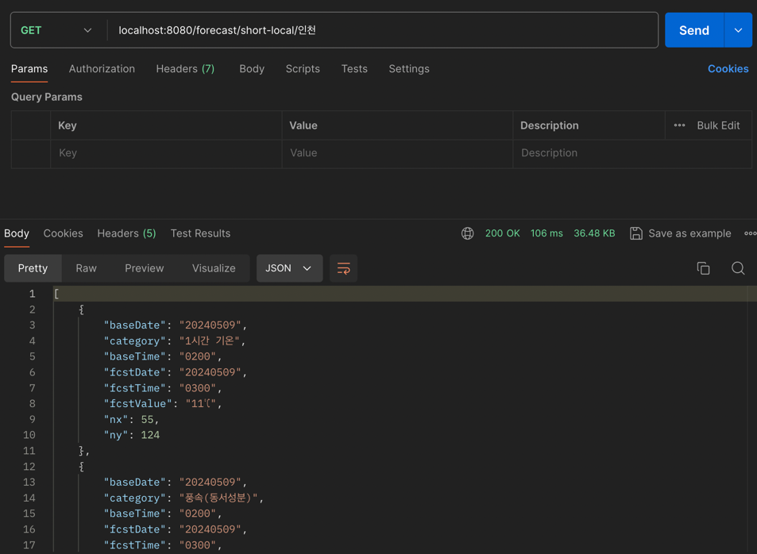

🔍 구현 대상 API
---

- 단기 예보를 DB에 저장하게 하는 API
    - POST 요청시 공공데이터 포털의 API를 호출하여 바로 DB 에 적재합니다.
    - 
    - 
  
- 단기 예보를 조회 하는 API
    - GET 요청시, DB 에 저장된 데이터를 조회합니다.
    - 
    - 데이터가 없을 경우, Http status 204 오류를 응답해야 합니다.
    - 

  🛠 기술 스택
---
- JAVA 17v
- SpringBoot 3.2.5v
- MySQL
- JPA

🛠 구조
---
- bigs-api
  - 메인 api 서버이며 controller, service로 구성
- bigs-domain
  - entity, repository로 구성
- bigs-util
  - 유틸 모듈로 공통으로 사용되는 코드 작성, api 요청 관련코드

⚠️ 해결과정
---
  1. ### restTemplate 사용시 키가 잘 못 되었다는 문제
    restTemplate에 url을 String으로 전달 시 자동으로 인코딩을 해주는데 인코딩 과정에서 +는 인코딩이 안되는 것을 발견 
    하지만 uriComponents를 사용하면 인코딩이 안된 url로 요청을 하기 떄문에 이를 사용하여 해결했습니다.

  2. ### 멀티모듈에서 빈을 찾지 못하는 문제
    
    Description:
    Parameter 0 of constructor in com.bigs.controller.ForecastController required a bean of type 'repository.ShortForecastRepository' that could not be found.
    
    모듈을 기준으로 컴포넌트 스캔을 진행하기 때문에 다른 모듈의 빈을 찾으려면 basePackage를 설정해야 된다는 것을 알았습니다.
    @ComponentScan, @EntityScan, @EnableJpaRepositories를 사용하여 basePackage를 명시애 해결했습니다.

📘아쉬운점
---
  1. ### 지역명으로 날씨 정보가져오기
    지역명으로 날씨를 가져오는 api를 다 못 만들었습니다.
    해당 기능 흐름으로는 지역명을 입력받아 kakaoLocalApi를 활용하여 해당 지역의 위도, 경도를 가져와
    날씨 api에서 제공해주는 좌표를 기준으로 반경 1.6km 지역의 x,y 좌표로 날씨 정보를 가져오려했는데 다 못 만들어서 아쉽습니다.

📘5월 8일 이후 추가사항
---
- ### 지역명으로 단기예보 적재 및 가져오는 기능 추가
    아쉬운 마음에 지역명을 입력 받아 해당 지역의 단기예보 적재 및 가져오는 기능을 추가했습니다.
    1. 지역명을 입력 받은 후 kakaoAPI를 호출하여 해당 지역의 위도, 경도를 추출
    2. 해당 지역의 위도, 경도를 기준으로 반경 1.6km 의 지역들을 db에서 호출
    3. 가져온 지역 후보들 중 입력 받은 지역을 기준으로 가장 가까운 지역의 nx,ny를 탐색
    4. 해당 지역의 nx, ny로 openAPI 호출

- ### 지역명으로 단기예보 적재 결과
  #### 포스트맨 결과
  

  #### db 및 행정위치좌표 일치
  

- ### 지역명으로 단기예보 검색 결과
  

- ### 카카오 api로 위치를 못 찾을때 에러 반환 추가

- ### api키 재발급
      기존 api키가 노출되어서 재발급 했습니다.
    